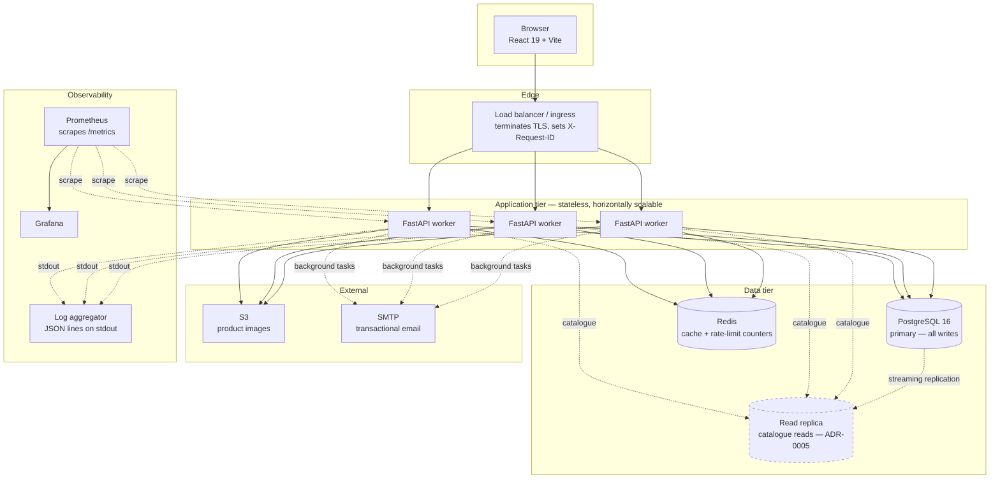
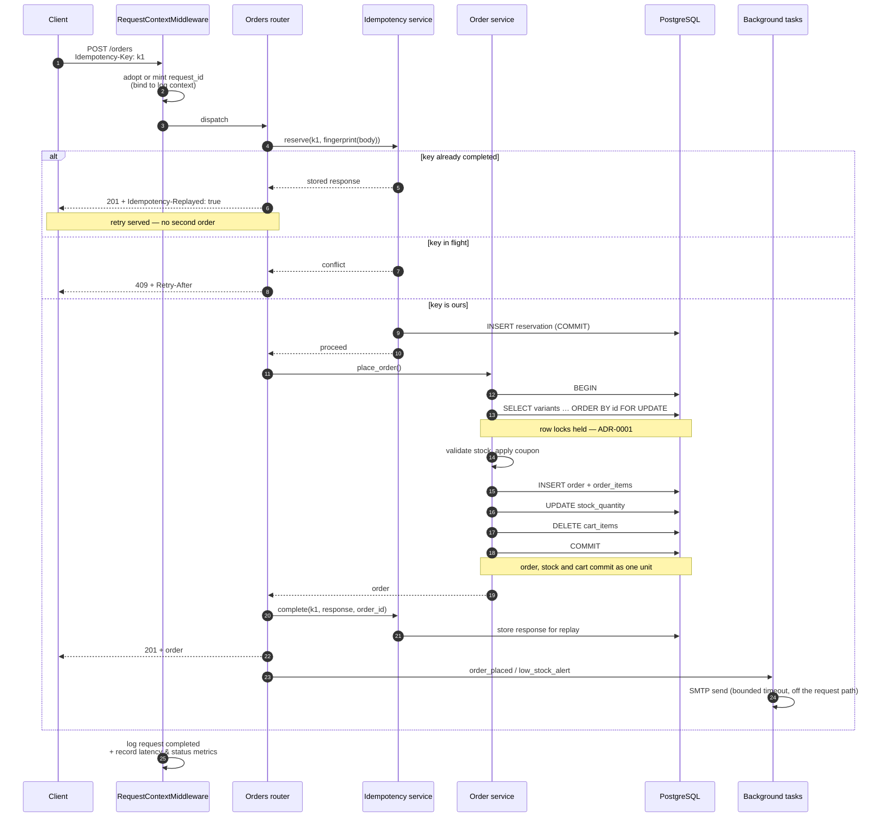
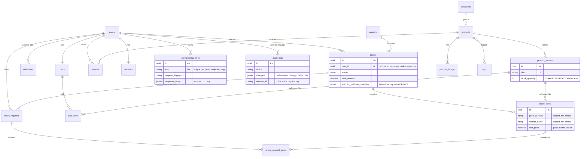

# Architecture

How the system fits together, what happens on the critical path, and where the
data lives. Decisions with real trade-offs are recorded separately as
[ADRs](adr/README.md); this document describes the shape that resulted.

## Deployment topology

The application tier holds no state: sessions are JWTs, the cart lives in
Postgres, and the cache is shared. Any worker can serve any request, so scaling
is adding workers until the database becomes the constraint — at which point
ADR-0005 (replicas) and ADR-0004 (caching) are the levers.

Dashed = designed and wired, not yet deployed.

## Checkout: the critical path

The one flow where correctness, concurrency and money intersect. Every numbered
step is instrumented with the same `request_id`.

Two properties this diagram is meant to make obvious:

* **Nothing that touches the network sits inside the database transaction.**
  Email happens after commit, in a background task with a bounded timeout —
  because a slow SMTP host inside the transaction would hold row locks and
  serialise every other checkout for the same product.
* **The idempotency reservation commits before the work starts.** That is what
  makes a crash mid-checkout produce a 409 on retry rather than a second order.

## Data model

The recurring theme: **transactional records copy what they need instead of
referencing it.** Order items copy product name and price; orders copy the
shipping address; audit entries copy the actor's email. Master data changes,
history must not (ADR-0002).

## Request lifecycle

Every request passes through the same envelope, which is what makes the system
observable without per-endpoint instrumentation:

```mermaid
flowchart LR
    in([Request]) --> rid["Adopt or mint<br/>X-Request-ID"]
    rid --> ctx["Bind request_id to<br/>log context (contextvar)"]
    ctx --> cors[CORS]
    cors --> route[Route handler]
    route --> auth["Auth dependency<br/>binds user_id to context"]
    auth --> work["Handler<br/>cache → replica → primary"]
    work --> resp["Response<br/>+ X-Request-ID header"]
    resp --> log["One structured log line:<br/>method, route, status, duration"]
    log --> met["Metrics: counter + histogram<br/>labelled by route template"]
    met --> out([Client])
```

A single `request_id` therefore joins: the access log line, every application
log line emitted while handling it, the audit entry if the request changed
something, and the idempotency record if it was a checkout. Given a customer
complaint and one ID, the entire causal chain is one query in the log
aggregator.

## Operational surface

| Endpoint | Purpose | Notes |
|---|---|---|
| `GET /health` | Liveness | No dependencies. A DB blip must not restart the fleet. |
| `GET /health/ready` | Readiness | Checks Postgres; reports Redis as degraded, not fatal. |
| `GET /metrics` | Prometheus scrape | Route-template labels only — no IDs, no cardinality explosion. |
| `GET /api/v1/audit-logs` | Admin audit trail | Read-only; no edit or delete path exists. |

### The three signals

| Signal | Metric | What it answers |
|---|---|---|
| Latency | `http_request_duration_seconds` | Is checkout slow? Is p99 diverging from p50 (contention)? |
| Error rate | `http_requests_total{status}` | What fraction of requests fail, by route? |
| Saturation | `db_pool_connections{state="in_use"}` | Are we about to exhaust the connection pool? |

Domain counters (`orders_placed_total`, `order_placement_failures_total{reason}`,
`idempotent_replays_total`, `cache_operations_total{outcome}`,
`rate_limit_rejections_total`) turn an alert into a diagnosis: a checkout error
spike with `reason="insufficient_stock"` is inventory, with
`reason="coupon_invalid"` is a broken campaign, and a rising replay rate means
clients are timing out before we answer.

## Security posture

* **Rate limiting** on login, registration and password change — per IP *and*
  per account, so neither a single host spraying accounts nor many hosts
  targeting one account gets unlimited guesses.
* **Audit log** on every privileged mutation: who, what changed (before/after),
  from which IP, tied to a request ID.
* **Password verification endpoints** are treated as guessing oracles and rate
  limited accordingly, not just the login route.
* **Bounded external calls**: SMTP has an explicit timeout, so a hung mail
  provider cannot exhaust the background-task thread pool.

Known gaps, deliberately not addressed here: CORS is `*` and needs an origin
allow-list before public deployment; JWTs are not revocable before expiry; and
`/metrics` is unauthenticated and must be blocked at the ingress.
